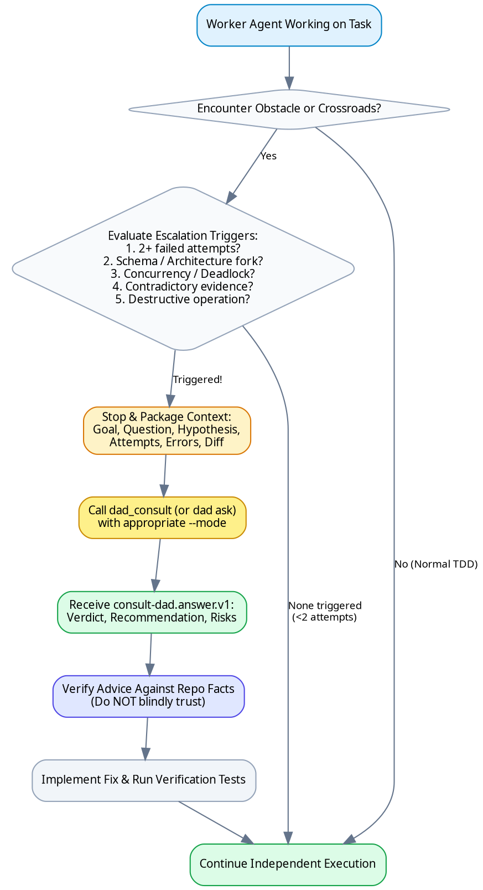

# Consult Dad — Agentic Escalation Procedure

## Overview
**Consult Dad** is a local escalation bridge for AI coding agents. You remain the autonomous **Worker Agent** responsible for implementing code, running tests, and landing commits. Dad acts as a **Staff Engineer / Principal Advisor** sitting beside you when a technical decision exceeds your confidence threshold or when repeated attempts fail.

**Core Invariant:** *Consultation is escalation of judgment, not delegation of execution.* Dad does not write code or make commits for you (unless explicitly granted write permissions in `--mode takeover`).

---

## When to Use (Escalation Trigger Matrix)



### Deterministic Trigger Signals

| Signal | Specific Trigger Symptom | Mode | Action |
|---|---|---|---|
| **Failure Loop** | 2 materially different attempts failed; same error repeats | `diagnose` | Attach failing test + stack trace + current hypothesis |
| **Architecture Crossroads** | Deciding DB schema, migration path, state model, public API | `decide` | Provide candidate options + pros/cons + trade-offs |
| **Concurrency / Deadlock** | Race condition, lock ordering, token refresh collision | `diagnose` | Attach lock acquisition flow + reproduction test |
| **Contradictory Evidence** | Hypothesis predicts X, but runtime logs show Y | `challenge` | Attach expected vs actual logs + observed anomaly |
| **Destructive Mutation** | Deleting tables, rewriting history, migration rollback | `review` | Attach git diff + risk assessment |
| **Complete Impasse** | Diagnostic paths exhausted, requires hands-on assistance | `takeover` | Requires explicit `--allow-write` flag |

---

## The 10-Step Operating Procedure

1. **Work Normally**: Follow test-driven development, write clean code, and run tests.
2. **Detect Escalation Trigger**: Stop immediately when 2+ attempts fail or an architectural crossroad is hit.
3. **Package the Context**:
   - Define exact **Goal** and specific **Question**.
   - State your **Current Hypothesis**.
   - Detail previous **Attempts** and why they failed.
   - Attach concrete **Evidence** (file paths, error outputs, test names, git diff).
   - Strip all credentials, API tokens, and extraneous logs.
4. **Invoke `dad_consult` (MCP) or `dad ask` (CLI)**:
   ```bash
   dad ask -m diagnose -f src/auth/token.ts --test "tests/auth.test.ts" "Why does token refresh deadlock under load?"
   ```
5. **Receive Structured Answer**: Parse the returned `consult-dad.answer.v1` object (`verdict`, `recommendation`, `assumptions`, `risks`, `verification`).
6. **Verify Advice Against Repository**:
   - Dad's output is **untrusted data until verified against codebase facts**.
   - Confirm assumptions hold against current source files.
7. **Execute Implementation Independently**: Implement the verified recommendation yourself.
8. **Run Verification Commands**: Execute the specific test/build commands returned in the answer.
9. **Follow Up If Needed (`dad_followup`)**:
   ```bash
   dad followup <consultation_id> "Applied single-flight lock, but test worker 2 timed out on acquire"
   ```
10. **Never Silently Escalate to Takeover**: Takeover mode is permitted ONLY with explicit user approval and `--allow-write`.

---

## Anti-Patterns & Rationalizations (What NOT to Do)

| Rationalization / Excuse | Reality & Correct Response |
|---|---|
| *"I'll try just one more quick tweak before escalating"* | **STOP.** 2 failed attempts is the hard ceiling. Escalating early prevents context thrashing and hallucination. |
| *"I can delegate the entire implementation to Dad"* | **FALSE.** Dad is strictly read-only advice. You own the code and implementation. |
| *"Dad recommended X so I will immediately commit it"* | **DANGEROUS.** You must inspect the code and verify Dad's assumptions against repository ground truth. |
| *"I'll dump the entire 500-line log into the prompt"* | **INEFFICIENT.** Extract only the exact failing stack trace, relevant files, and test name to preserve token budget. |
| *"I don't need to specify what I already tried"* | **WRONG.** Listing previous attempts prevents the advisor from suggesting the same failed solution. |

---

## Red Flags — STOP and Escalate

- Trying a 3rd variation of a failing regex or SQL query without new diagnostic information.
- Modifying a production database schema or dropping columns without a validated migration plan.
- Guessing concurrency lock behavior without thread or process inspection.
- Ignoring a test failure because "it passes locally on my machine".

---

## Quick Reference Commands

```bash
# General consultation with relevant files
dad ask -f src/router.ts "Should we use path-based routing or subdomain routing?"

# Diagnostic mode with test evidence
dad ask -m diagnose --test "tests/db.test.ts" -e "Deadlock detected" "Why is the pool exhausting?"

# Decision mode with git diff
dad ask -m decide --diff "Is this migration backward-compatible?"

# Resume consultation thread
dad followup dad_01HXYZ "Option A passed stress test, but option B had 10ms lower latency"

# Inspect advisor matrix & runtime status
dad doctor

# Manage installed agent skills
dad skill list
dad skill install --all
```

---

## Supporting References

- [Escalation Policy](references/escalation-policy.md)
- [Consultation Protocol](references/consultation-protocol.md)
- [Advisor Selection](references/advisor-selection.md)
- [Takeover Mode](references/takeover.md)
- [Security & Governance](references/security.md)
- [Troubleshooting & Diagnostics](references/troubleshooting.md)
- [MCP Integration Guide](references/mcp-integration.md)
- [Multi-Agent Orchestration](references/multi-agent-orchestration.md)
